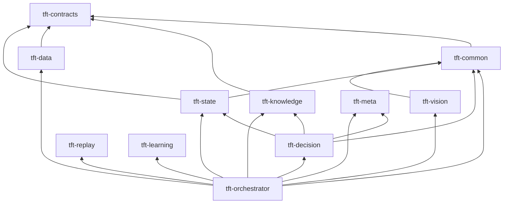

# 模块一览

## Maven 多模块结构

```
tft-vision-ai-coach (parent)
├── tft-contracts      # JSON Schema + 校验
├── tft-common         # FeatureFlag / Trace / 云端降级契约
├── tft-data           # 数据源适配（P1+）
├── tft-knowledge      # 知识库（P1+）
├── tft-vision         # 视觉识别（P2+）
├── tft-state          # GameState（P2+）
├── tft-meta           # Meta（P3+）
├── tft-decision       # 决策 Agent（P3+）
├── tft-replay         # 复盘（P4+）
├── tft-learning       # 个人教练（P4+）
└── tft-orchestrator   # Spring Boot 入口
```

仓库根目录另有 `vision-sidecar/`（Python FastAPI，非 Maven 模块）。

## 域与 Phase

| 模块 | 域 | 最早 Phase | 职责 |
|------|-----|------------|------|
| tft-contracts | 契约 | P0 | Canonical / Agent JSON Schema |
| tft-common | 公共 | P0 | Feature Flag、Trace、Provider 降级契约 |
| tft-data | DATA | P1 | Riot API、Data Dragon 适配 |
| tft-knowledge | KNOWLEDGE | P1 | 静态知识、规则引擎输入 |
| tft-vision | VISION | P2 | 截图/OCR、UI 元素识别 |
| tft-state | STATE | P2 | GameState 聚合与版本化 |
| tft-meta | META | P3 | 版本 Meta、阵容胜率 |
| tft-decision | DECISION | P3 | 多 Agent 编排与候选输出 |
| tft-replay | REPLAY | P4 | 赛后复盘 |
| tft-learning | LEARNING | P4 | 个人化教练 |
| tft-orchestrator | 编排 | P0 | HTTP 入口、模块装配 |
| vision-sidecar | VISION | P2 | 本地 HTTP OCR/CV（可选 Paddle） |

## 依赖方向



## P0 交付映射

| ID | 落地位置 |
|----|----------|
| P0-FOUND-Repo-001 | 根 `pom.xml`、`docs/branching/BRANCHING.md` |
| P0-FOUND-Build-001 | Java 21 / Boot 3.3.5 / Enforcer |
| P0-FOUND-CI-001 | `.github/workflows/ci.yml`、`scripts/local-ci.ps1` |
| P0-FOUND-Safety-001 | `scripts/safety-scan.ps1` + 违规负例 |
| P0-FOUND-Contract-001 | `schemas/canonical/*` + 版本治理 |
| P0-FOUND-AgentContract-001 | `schemas/agent/*` + 5 样例 |
| P0-FOUND-Observability-001 | `TraceService`、`/api/v1/trace/*` |
| P0-FOUND-FeatureFlag-001 | `tft.flags.*`，Live 默认 false |
| P0-FOUND-TestData-001 | `fixtures/*` 七类 manifest |
| P0-FOUND-Degrade-001 | `DegradeRouter`、`docs/architecture/degrade-matrix.md` |
