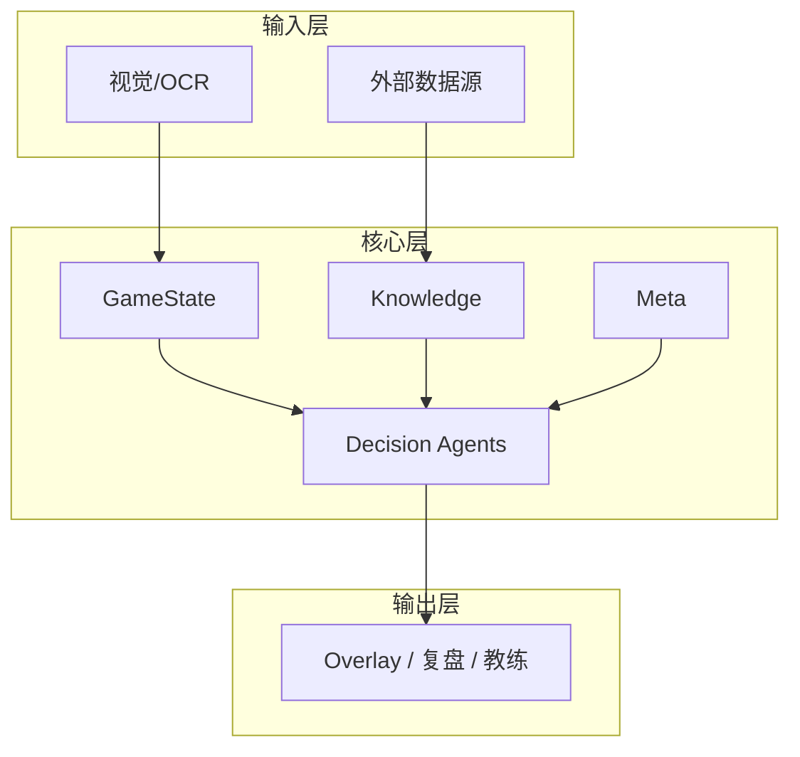

# 需求概述

> 唯一需求与任务基线：
> [`TFT_Vision_AI_Coach_Complete_Roadmap_V3_1.html`](https://github.com/NealWizard/tft-vision-ai-coach/blob/develop/TFT_Vision_AI_Coach_Complete_Roadmap_V3_1.html)。
> 旧 PRD 已移入 `历史需求文档/`，仅供追溯。

## 项目背景

云顶之弈（TFT）单局内信息密度极高：阵容、经济、装备、站位、对手 counter、赛季机制等决策并行。现有 Overlay 类工具多为**静态数据展示**，缺乏基于实时对局状态的**动态决策推理**。

本项目构建：**实时感知对局 + 联网大数据 + AI 决策推理** 的动态辅助 Agent。

## 核心定位

| 维度 | 说明 |
|------|------|
| 不是外挂 | 不注入进程、不自动操作，仅信息采集与建议 |
| 不是静态攻略 | 基于实时状态动态推理 |
| 是「副驾驶」 | 玩家做最终决策，Agent 提供数据与候选建议 |

## 核心目标（摘要）

| 维度 | 指标 |
|------|------|
| 决策覆盖 | 买牌、D 牌、升级、装备、强化、站位、变阵 |
| 数据时效 | 外部数据延迟 ≤30min；对局识别 ≤1s |
| 性能 | 单回合推理 ≤500ms；内存 ≤500MB |
| 合规 | 纯屏幕采集 + 外部数据，零读内存/注入 |

## 系统分层（概念）

## 与工程 Phase 对应

| Phase | 工程重点 |
|-------|----------|
| P0 | 工程地基、安全边界、Contract、可观测与云端降级 |
| P1 | Knowledge & Data Platform：Data、Tools、RAG、Cloud LLM |
| P2 | 视觉 + GameState |
| P3 | Meta + Decision Agent |
| P4 | 复盘 + 个人教练 |
| P5 | Orchestrator + AI Routing |
| P6 | Live 实验（默认关闭） |
| P7 | 产品化 |

详细任务见 [任务路线图](../roadmap/user-story.md)。
